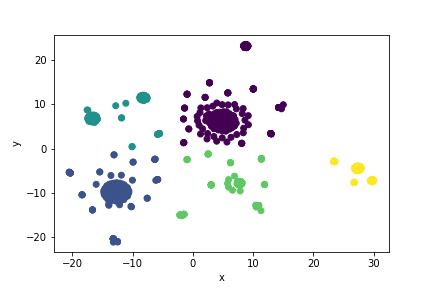

# Cryptocurrency Clusters

In this challenge, I used unsupervised learning to classify a dataset of cryptocurrencies found in the trading market. Our client is interested in offering a new cryptocurrency investment portfolio for its customers. My job was to determine if they can be grouped to create a classification system for this new investment.

### Data Preparation

The dataset came from CryptoCompare (https://min-api.cryptocompare.com/data/all/coinlist)

The columns contained:
  - CoinName
  - Algorithm
  - IsTrading
  - ProofType
  - TotalCoinsMined
  - TotalCoinSupply

To prepare the data, I filtered out rows where IsTrading is false or total coins mined was zero. I also dropped any row containing a null value.

Then, I converted Algorithm and ProofType to numeric using pandas get_dummies() function.

For use in the machine learning model, I scaled the data using standard scalar so that larger values do not unduly influence the outcome.

### Dimensionality Reduction

I used PCA for dimensionality reduction since the get_dummies function turned the dataset into 96 columns. I reduced the features further using t-SNE and created a scatter plot of the results. Using an elbow plot and k-Means, we were able to distinguish the number of classes than can be used to group the cryptocurrencies.

### Results

<b>Tip:</b>There are currently 532 coins on the trading market. Based on our analysis using machine learning techniques, the Advisory Services Team recommends the cryptocurrencies be grouped together into 5 classes.

